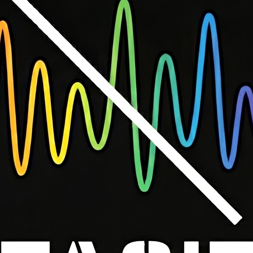

# Tacit

<p align="center">
  
</p>

<p align="center">
  <strong>Modern, private, local-first automated podcast ad removal.</strong><br>
  Empowering individuals with offline-first audio processing, local Faster-Whisper ASR, and LLM sponsor detection.
</p>

---

## Features

- **Automated Directory Sweeps**: Monitors your podcast downloads folder for `.mp3`, `.m4a`, `.aac`, and `.ogg` files.
- **Speech-to-Text Integration**: Streams audio directly to local Faster-Whisper ASR for precise timestamping.
- **LLM Commercial Detection**: Evaluates transcript windows using Ollama, vLLM, or OpenAI-compatible endpoints to identify host sponsor reads.
- **Surgical FFmpeg Audio Cutting**: Trims identified ad blocks without re-encoding, preserving 100% original audio quality and metadata.
- **Audiobookshelf (ABS) Sync**: Triggers automatic rescan and progress updates in your Audiobookshelf media server.
- **Idempotent Metadata Tagging**: Embeds a `copyright=ADFREE` tag to prevent redundant processing.

---

## Quickstart

### Docker Compose

```yaml
version: "3.8"

services:
  tacit:
    image: runtacit/tacit:latest
    container_name: tacit
    restart: unless-stopped
    ports:
      - "8822:8822"
    environment:
      - WATCH_DIRECTORY=/podcasts
      - STT_ENDPOINT_URL=http://whisper:9000/asr
      - LLM_ENDPOINT_URL=http://ollama:11434/v1
      - LLM_MODEL_NAME=qwen2.5:14b
      - SCAN_INTERVAL_MINUTES=60
      - PUID=1000
      - PGID=1000
      - UMASK=022
    volumes:
      - /path/to/podcasts:/podcasts
      - /path/to/config:/config
```

### Unraid Community Applications

Tacit is available for Unraid! Use the icon link below for custom container setup:

- **Icon URL**: `https://raw.githubusercontent.com/runtacit/tacit/main/assets/icon.png`
- **Dashboard Web UI**: `http://[IP]:[PORT:8822]/`

---

## Assets & Icons

All official high-resolution branding assets and Docker icons are available in the [`assets/`](assets/) directory:

- [`assets/icon.png`](assets/icon.png) — 512x512 Square transparent app icon (ideal for Docker / Unraid CA / GitHub)
- [`assets/logo-black.png`](assets/logo-black.png) — Full horizontal logo (dark theme)
- [`assets/logo-white.png`](assets/logo-white.png) — Full horizontal logo (light theme)

---

## Website & Documentation

Visit [runtacit.com](https://runtacit.com) for official news, release notes, and documentation.
